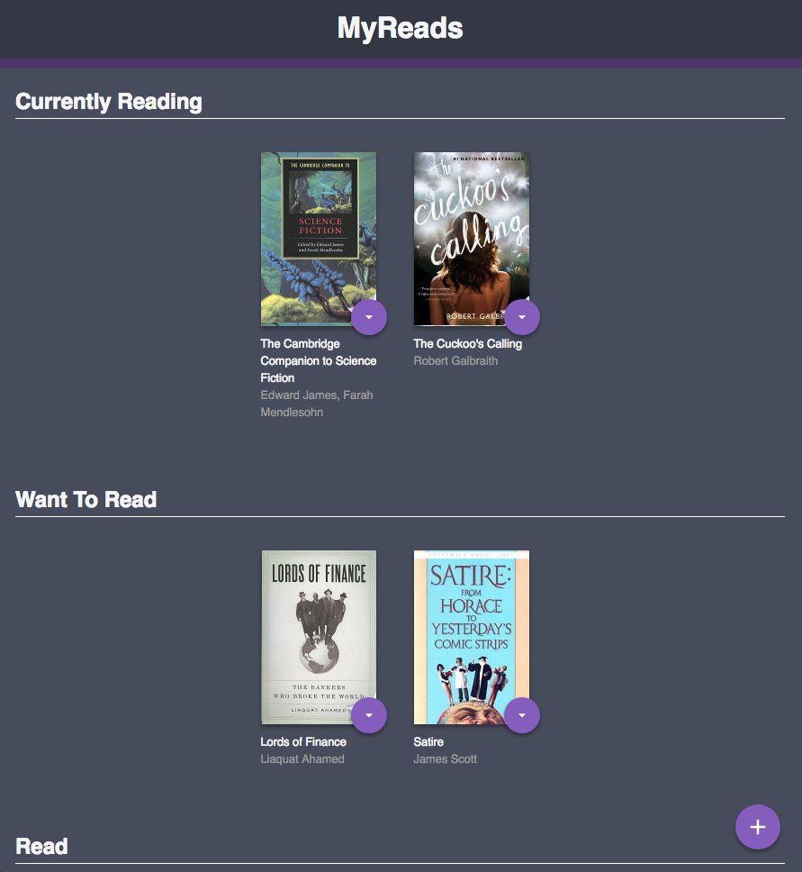

# MyReads Project
---
## Purpose:
A React Application Built for the React Udacity Nanodgree Program to gain experience in React and React Router.

### How To Run:
1. Clone the project `git clone git@github.com:Rykuno/MyReads-React.git`
2. Navigate to the project directory and run `npm install`
3. Once dependencies have finished installing `npm start`
4. A new browser window should open up with the app.

### How to Use:
* The main page categorizes your books into three main sections (`Currently Reading`, `Want To Read`, and `Read`).
* To change a book's shelf, simply selected the desired location on the purple drop down.
* To add new books, select the + icon at the bottom left of the page. This will bring you to a search menu (search terms specified below).

### Resources
* [React-Router Documentation](https://reacttraining.com/react-router/web/guides/philosophy)
* [Airbnb Javascript Style Guide](https://github.com/airbnb/javascript)
* [Udacity Rubick](https://review.udacity.com/#!/rubrics/918/view)

#### Search Terms
'Android', 'Art', 'Artificial Intelligence', 'Astronomy', 'Austen', 'Baseball', 'Basketball', 'Bhagat', 'Biography', 'Brief', 'Business', 'Camus', 'Cervantes', 'Christie', 'Classics', 'Comics', 'Cook', 'Cricket', 'Cycling', 'Desai', 'Design', 'Development', 'Digital Marketing', 'Drama', 'Drawing', 'Dumas', 'Education', 'Everything', 'Fantasy', 'Film', 'Finance', 'First', 'Fitness', 'Football', 'Future', 'Games', 'Gandhi', 'Homer', 'Horror', 'Hugo', 'Ibsen', 'Journey', 'Kafka', 'King', 'Lahiri', 'Larsson', 'Learn', 'Literary Fiction', 'Make', 'Manage', 'Marquez', 'Money', 'Mystery', 'Negotiate', 'Painting', 'Philosophy', 'Photography', 'Poetry', 'Production', 'Programming', 'React', 'Redux', 'River', 'Robotics', 'Rowling', 'Satire', 'Science Fiction', 'Shakespeare', 'Singh', 'Swimming', 'Tale', 'Thrun', 'Time', 'Tolstoy', 'Travel', 'Ultimate', 'Virtual Reality', 'Web Development', 'iOS'
